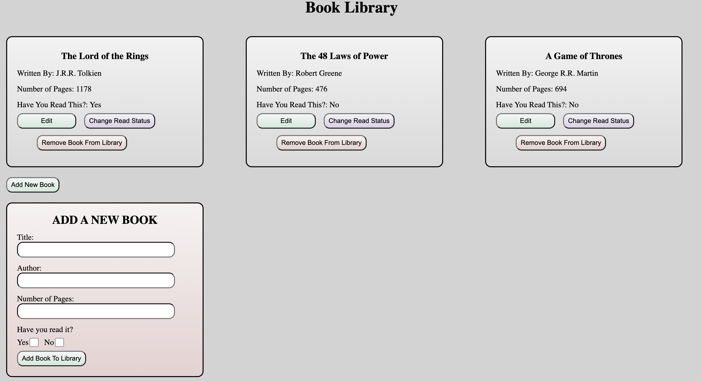

# Book Library Project
This project is a book library management system built with HTML, CSS and Javascript.  
It allows the user to add, edit and delete books from their collection of books. 
It also show which books you have read and the books you have not read.

Live Demo:
https://prosperjohn9.github.io/library

Desktop View:

This project was created for the [Library](https://www.theodinproject.com/lessons/node-path-javascript-library) assignment as part of The Odin Project curriculum.

# Objectives
1. Store books as objects in an array.
2. Display books as cards.
3. Create New Book form to add books.
4. Button for each book to remove it from library.
5. Button for each book to change read/unread status.
6. Button for each nook to edit the contents.